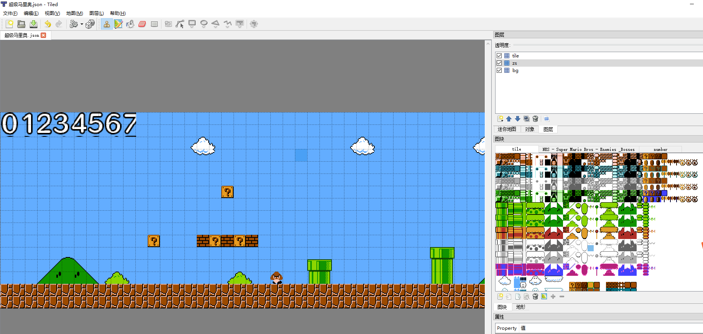
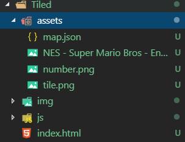

## 显示Tiled 图像

如果你有使用过Tiled或者了解过图集块地图的话如下：



如何将这种由图集块拼接的图像显示出来呢，你可能回想为什么不直接输出显示
整张图像即可？如果你仅仅只是想显示图像效果那确实可以直接输出。但是一般
使用图集块图像我们都需要它的位置信息，即该物体块位于坐标轴那一点，这样
我们才好判断该地图块是否碰撞或者改变。为每一个单元格物体块提供物体信息。
Tiled就是这样的工具。下面我们介绍如何在Web上显示Tiled图像。

## 工具Tiled

制作Tiled图集块图像需要Tiled软件，我这里使用的是`Tiled`市面上司免费的
不同软件打包可能数据有差异。可以参考源码自行修改解析脚本。这里以Tiled生成的
JOSN文件为基准。


## JSON文件

在Tiled上编辑好地图之后到出生成json文件，注意要修改json文件部分属性,如下是软件生成的json文件示例:

```json
{ 
 "height":16,
 "layers":[
        {
         "data":[...], //这里过长已经省略了
         "height":16,
         "name":"bg",
         "opacity":1,
         "type":"tilelayer",
         "visible":true,
         "width":80,
         "x":0,
         "y":0
        }, 
        {
         "data":[...],
         "height":16,
         "name":"zs",
         "opacity":1,
         "type":"tilelayer",
         "visible":true,
         "width":80,
         "x":0,
         "y":0
        }, 
        {
         "data":[...],
         "height":16,
         "name":"tile",
         "opacity":1,
         "type":"tilelayer",
         "visible":true,
         "width":80,
         "x":0,
         "y":0
        }],
 "orientation":"orthogonal",
 "properties":
    {

    },
 "renderorder":"right-down",
 "tileheight":16,
 "tilesets":[
        {
         "firstgid":1,
         "image":"..\/..\/..\/BaiduNetdiskDownload\/2010221\/\u590d\u53e4\u50cf\u7d20\u9a6c\u91cc\u5965\/\u6742\u9879\u5143\u7d20\/tile.png",
         "imageheight":448,
         "imagewidth":528,
         "margin":0,
         "name":"tile",
         "properties":
            {

            },
         "spacing":0,
         "tileheight":16,
         "tilewidth":16
        }, 
        {
         "firstgid":925,
         "image":"..\/..\/..\/BaiduNetdiskDownload\/2010221\/\u590d\u53e4\u50cf\u7d20\u9a6c\u91cc\u5965\/\u4e3b\u89d2\u548c\u654c\u4eba\/NES - Super Mario Bros - Enemies & Bosses.png",
         "imageheight":128,
         "imagewidth":808,
         "margin":0,
         "name":"NES - Super Mario Bros - Enemies & Bosses",
         "properties":
            {

            },
         "spacing":0,
         "tileheight":16,
         "tilewidth":16
        }, 
        {
         "firstgid":1325,
         "image":"number.png",
         "imageheight":192,
         "imagewidth":192,
         "margin":0,
         "name":"number",
         "properties":
            {

            },
         "spacing":0,
         "tileheight":17,
         "tilewidth":17
        }],
 "tilewidth":16,
 "version":1,
 "width":80
}
```

需要注意的是一般情况下都 *需要修改tilesets属性下的image属性* 因为导出json文件是以Tiled工作目录为根目录的，`而我们在项目中使用就需要修改这个地址！同时我们也要将你使用的图集块图片添加到项目中`。如下项目格式:



3张图片是使用的图集块图片。map.json是导出的json文件我们需要修改json文件如下属性:

```json
{ 
 ......
 "renderorder":"right-down",
 "tileheight":16,
 "tilesets":[
        {
         "firstgid":1,
         "image":"assets/tile.png",//修改为html对应的相对路径
         "imageheight":448,
         "imagewidth":528,
         "margin":0,
         "name":"tile",
         "properties":
            {

            },
         "spacing":0,
         "tileheight":16,
         "tilewidth":16
        }, 
        {
         "firstgid":925,
         "image":"assets/NES - Super Mario Bros - Enemies & Bosses.png", //修改为html对应的相对路径
         "imageheight":128,
         "imagewidth":808,
         "margin":0,
         "name":"NES - Super Mario Bros - Enemies & Bosses",
         "properties":
            {

            },
         "spacing":0,
         "tileheight":16,
         "tilewidth":16
        }, 
        {
         "firstgid":1325,
         "image":"assets/number.png",//修改为html对应的相对路径
         "imageheight":192,
         "imagewidth":192,
         "margin":0,
         "name":"number",
         "properties":
            {

            },
         "spacing":0,
         "tileheight":17,
         "tilewidth":17
        }],
 "tilewidth":16,
 "version":1,
 "width":80
}
```

如上修改需要访问地方的相对路径即可！如果定位准确也可以使用绝对路径

### 使用

已经使用PIXI封装完毕直接使用Tiled构造类即可实现，构造函数参数为json数据对象

```js
//加载json文件
app.loader.add('assets/map.json');
app.loader.load(()=>{
    var s = new Tiled(app.loader.resources["assets/map.json"].data);
    app.stage.addChild(s);
});
```

### API

参考js/main.js的Tiled类方法，注释已给出

### Demo

运行index.html界面即可看到，注意需要Web访问环境，不能直接使用浏览器直接打开html文件!